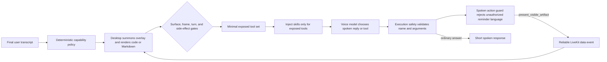

# Voice Agent — talking to Buddy out loud

**One line:** real-time spoken conversation with Buddy, running as its own always-listening
service, with the same persona and memory as text chat but tuned for a live back-and-forth.

**Why it exists:** voice is the most natural way to have a companion. It is also the feature
the beta is built around (accountability check-ins), so it has to feel immediate and never
just go silent on you.

---

## How a voice call flows

```
you tap the mic
      │
      ▼
you join a live voice room; Buddy (a separate voice worker) joins and greets you
      │
      ▼
you speak → speech-to-text → Buddy thinks (with your memory + a COMPACT digest) → speaks back
      │                                                                              │
      └──────────────────────────── turn by turn ───────────────────────────────────┘
      │
      ▼
you hang up; the full conversation is saved, and a short reflection updates your aura
```

---

## The context trick (why it stays sharp)

A voice prompt is built ONCE at the start of the call and rides every turn. If you stuff the
whole history in there, the model drifts. So:

```
LIVE PROMPT  =  persona + rules + a COMPACT digest of what matters (kept small)
FULL HISTORY →  saved in the archive (nothing is lost)
NEED AN OLD DETAIL?  →  Buddy fetches it on demand with a tool, instead of carrying it all hot
```

Leaner live prompt means more room to actually converse AND better rule-following.

The live conversation history is bounded too. `voice/context_compaction.py` starts a
background summary after 16 completed user turns or about 6,000 dynamic tokens. It
folds the oldest complete turn groups into one structured summary, keeps the latest
8 raw turns, and applies the result only at the next finalized user boundary through
LiveKit's public `update_chat_ctx()` API. The full recorder transcript is unchanged.

```text
turns 1-16 complete
  -> background summary snapshots exact item IDs for turns 1-8
  -> turns 9-16 remain raw while the user keeps talking
  -> next finalized boundary validates the IDs, installs one summary, keeps the tail
  -> any changed boundary discards the stale result instead of overwriting newer context

hard ceiling at 20 raw turns
  -> keep the last good summary
  -> deterministically retain the latest 10 complete turns
  -> never let a compaction failure authorize a tool or block the user's reply
```

Tool behavior that does not belong in every turn is loaded as a focused per-tool skill. The
deterministic action policy first decides which capabilities are active; only those capabilities'
briefs are copied into that inference. A skill improves selection and formatting, but cannot
override surface, freshness, finalized-turn, dependency, or write-authorization gates.



Visible output is a presentation capability, not an email trick. Commands, code, configuration,
prompts for another agent, checklists, and multi-step guidance use
`present_visible_artifact`. Email replies and DMs continue to use `draft_outbound_message`.
Presentation does not require a screenshot, does not authorize or execute a command, does not use
the outbound-draft quota, and does not persist content. A publish failure is reported as a
failure, so Buddy never claims text is on screen when it is not.

```text
"Give me the PowerShell command to fix execution policy"
  -> visible_artifact(command) -> exact copyable code card -> "I put it on screen."

"Look at this error and write a prompt for the coding agent in my repo"
  -> fresh frame informs the answer -> visible_artifact(prompt) -> Markdown prompt card

"What should I do next on this setup screen?"
  -> fresh frame informs the answer -> visible_artifact(steps) -> ordered Markdown steps

"Stop speaking so loudly"
  -> spoken style correction only; no card

"Don't read the command out loud" or a failed artifact followed by "again"
  -> forced visible-artifact repair; requested content is not recited
```

---

## Two worked examples

```
EXAMPLE 1 — the "connected but never speaks" safety net
   you join → Buddy should greet you within a few seconds
        ▼
   a silence watchdog (15s) is armed when Buddy joins, and after each of your turns
        ▼
   if Buddy goes silent (e.g. the language model ran out of credit), the watchdog fires
        ▼
   you get a friendly, coded error and the mic orb becomes a retry button,
   instead of staring at a dead screen waiting forever
```

```
EXAMPLE 2 — the free-tier "1 minute left" warning, done gracefully
   the server (NOT the model) owns the countdown
        ▼
   at T-60s it injects a one-shot instruction: "mention ~1 min left warmly, then keep talking"
        ▼
   Buddy weaves it in at the next natural pause, in its own voice, without cutting you off
        ▼
   at T-0 it queues ONE graceful closing line, THEN ends, never a hard cut to silence
```

---

## Guardrails

Unresolved writes belong to one source message and expire after the next user
turn. Summaries are informational only and can never recreate action authorization.
Worker logs include the source hash, build time, policy version, and compactor
version so a reported call can be tied to the code that handled it.

```
▸ lean live prompt + an async digest built off your turn (never recomputed mid-reply)
▸ the watchdog covers the silent-hang; both client and server can raise a coded error
▸ errors are mapped to friendly copy; success/failure are tracked for monitoring
```

---

## Where this connects

Voice shares Buddy's persona and reads/writes the same [aura profile](./user-aura.md) as
[chat](./chat-and-tools.md). Feedback you say out loud routes through the
[feedback relay](./feedback-relay.md). It runs as a separate worker (it is a live audio
pipeline, not a request/response endpoint).

---

## Code map (for engineers)

```
backend/src/agent/
  voice_agent.py     the thin orchestrator + the worker entrypoint
  buddy_agent.py     class BuddyAgent — the actual LiveKit agent instantiated per voice session
  voice/action_policy.py     deterministic per-turn capability and execution gates
  voice/context_compaction.py async structured summary + exact-boundary replacement
  voice/capabilities.py      tool registry, effects, surfaces, and skill names
  voice/spoken_action_guard.py sentence-level side-effect language filter and retry
  voice/revision.py          secret-free worker source and policy version identity
  voice/tool_skills.py       focused instructions injected only for exposed tools
  voice/visible_artifacts.py reliable ephemeral desktop presentation transport
  voice/             the other pieces: pipelines, prompt context, errors, and recorder
  voice_prompt.py    the VOICE_PROMPT persona + rules
backend/src/services/voice_session_summarizer.py   the after-call reflection into the aura
```

The voice worker runs on LiveKit Cloud Agents (it was migrated off an always-on server to
cut idle cost). Telemetry and friendly error copy are described in CLAUDE.md's voice section.
